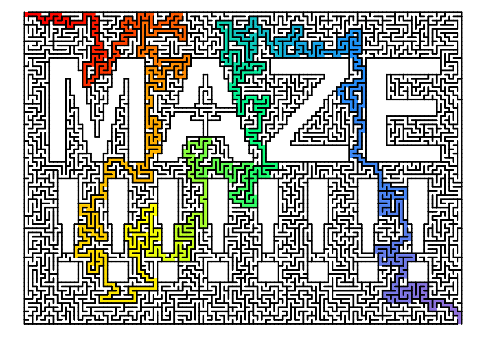
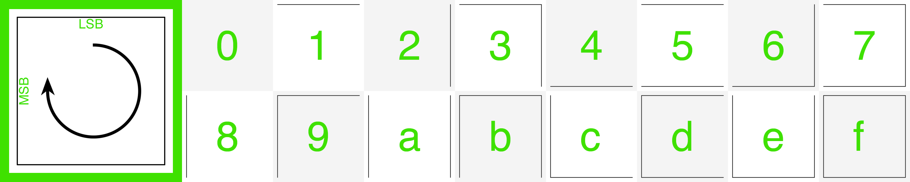

### MAZE GENERATOR

I've implemented 7 algorithms in C++ to procedurally generate perfect two-dimensional mazes! Perfect mazes contain no loops, and for each point in the maze, there is exactly one path to any other point in the maze. One of the algorithms I implemented takes a 2D bitmask as an input, so it can generate mazes in different shapes. [This webpage](https://www.astrolog.org/labyrnth/algrithm.htm) is an excellent primer on maze classification and the tradoffs/biases of different maze generation algorithms. 

TODO (when I have time, and in a different repo): use openCV's contour detection on images to algorithmically generate mazes that loosely resemble [Christopher Berg's hand-drawn mazes](http://www.amazeingart.com/free-mazes/more-free-mazes.html).

### USAGE

I wrote this program for myself as the end-user, but I'm including usage instructions in case someone else finds part/all of it useful. I wish I'd written more comments in the code for you.

To create executable: navigate to `generator-src` and enter `make` (this worked with no warnings or errors using macOS & Fedora, but no guarantees obviously lol).

The program prints out your maze encoded as a string, where each cell is represented by a hex digit. Open the webpage in `maze_renderer`, and paste your maze into the form. On the page you can: view your maze, save a png of your maze, and toggle a solution on/off. If you want to write your own generator, and just use the renderer, the cells are encoded like this: 

By default the program creates a 10x10 maze.

If you give one argument, it should be a path to a text file that represents a mask in the shape of your maze. Where you want the maze to fill should be represented by 'x', and where you don't want it to fill should be represented by a ' '. Every component should be connected, even if just by one line of x's. See the masks directory for an example (I created this mask of RC's logo using a Javascript thing I wrote).

If you give two arguments, they should be integers that represent the number of rows and columns (respectively) that you want the rectangular maze to be.

I use a recursive backtracking algorithm by default. If you want to change this, fiddle around with the source code in `/generator-src/maze.cpp`. A couple of the other algorithms create differently-textured mazes because of their biases :)